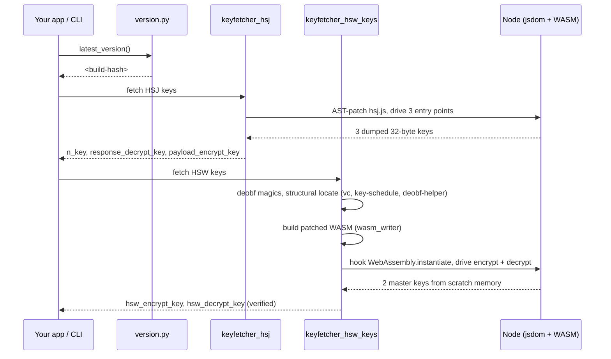

<div align="center">
    <h1>hCaptcha</h1>
    <p>Open-source <strong>hCaptcha</strong> internals — byte-accurate master-key extraction for both <code>hsj.js</code> and <code>hsw.js</code>, with the deobfuscator and WASM tooling that makes it reproducible per build.</p>
    
    
    
    <br>
    <a href="https://t.me/jujucodings"></a>
    <br>
    <br>
</div>

## Introduction

hCaptcha ships two compiled client bundles to every browser. Both encrypt their wire traffic with static **AES-256-GCM** master keys baked into the build:

| Bundle | Compile target | Keys |
|--------|----------------|------|
| `hsj.js` | asm.js-style compiled JS | `n_key`, `response_decrypt_key`, `payload_encrypt_key` |
| `hsw.js` | wasm-bindgen Rust → WebAssembly | `encrypt_key`, `decrypt_key` |

This repository recovers all **five** master keys per build, deterministically, with no candidate-guessing — and ships the disassembler, byte-perfect WASM re-emitter, and 12-pass deobfuscator that make it work.

The HSW encrypt key is mathematically verified per fetch via AES-256-GCM's authentication tag (false-positive rate **2⁻¹²⁸**).

---

## How it works



| Step | Location | Output |
|------|----------|--------|
| Version discovery | `version.py` | Asset URL with build hash |
| HSJ extraction | `keyfetcher_hsj.py` | 3 AES-256 keys (AST patch on the key schedule) |
| HSW extraction | `keyfetcher_hsw_keys.py` | 2 AES-256 keys (WASM bytecode patch) |
| Unified entry | `keyfetcher.py` | All 5 keys + cipher / wire metadata |

**Key schedule (HSJ).** hsj.js keeps its AES keys in a JS-managed `Int8Array` heap; the key schedule always allocates a 480-byte stack frame with the 32-byte master key at offset 0. We AST-patch that prologue to copy those 32 bytes into a JS array each time it fires, then drive the three entry points.

**Key schedule (HSW).** hsw.js uses RustCrypto `aes-soft` fixslice32 — the master key never lives as 32 contiguous plain bytes in linear memory. We patch the WASM bytecode itself: 8 calls to the build's XOR-deobf helper at the key schedule's entry, each copying one deobfuscated key word to a fixed scratch region. JS reads scratch via a new `__peek32` export we add to the same patched binary.

Function indices, magic numbers, locals, and stack offsets rotate every build. The fetcher locates every component by **structural role** — never by index — so it works on every rotation without manual updates.

---

## Repository layout

```
.
├── README.md
├── docs/                            ← deep-dive documentation
│   ├── 00-architecture.md           overall flow, repo map, pipeline
│   ├── 01-hsj-bundle.md             HSJ internals + AST-patch extraction
│   ├── 02-hsw-bundle.md             HSW dispatcher, wbg shim, wire formats
│   ├── 03-deobfuscation.md          12-pass deobf pipeline
│   ├── 04-key-extraction.md         status of every key, methods
│   ├── 05-wasm-internals.md         WASM 1.0 binary format reference
│   ├── 06-fixslice32.md             bit-sliced AES math
│   └── 07-wasm-patching.md          the bytecode-patching technique
│
├── keyfetcher.py                    ← unified entry, all 5 keys
├── keyfetcher_hsj.py                HSJ extractor (3 keys)
├── keyfetcher_hsw.py                HSW bridge + analyzer (encrypt/decrypt as a service)
├── keyfetcher_hsw_keys.py           HSW extractor (2 keys, WASM bytecode patch)
│
├── wasm_disasm.py                   WASM 1.0 disassembler + structural locators
├── wasm_writer.py                   WASM 1.0 byte-perfect re-emitter / patcher
├── fixslice_inverse.py              fixslice32 bitslice / inv_bitslice (reference)
│
├── deobf.py + deobf.js              12-pass deobf pipeline
├── js_runtime.py + _js_runner.js    Node + jsdom sandbox bridge
│
├── algorithm.py                     AES-256-GCM + xxhash + msgpack helpers
├── version.py                       asset-version discovery
└── log.py                           minimal Logger
```

---

## Install

Requires **Python 3.10+** and **Node 18+**.

```bash
git clone https://github.com/jujucodings/hcaptcha
cd hcaptcha
pip install pycryptodome xxhash msgpack jsbeautifier requests
npm install
```

---

## CLI

```bash
python keyfetcher.py
```

Output (~8 seconds end-to-end):

```json
{
  "version": "85205c14d08c1288bd2348025639e667aa2ca31bd57ad96251110595ec621384",
  "hsj": {
    "n_key":                "fe1ba43f33813dbac034ef12f34f3ee371b09057e2a25346a652c681edb2104b",
    "response_decrypt_key": "2fb5e0f6aab9596b2001c45ce12cad34e82d579dfea24409fe9b7de4b82d4028",
    "payload_encrypt_key":  "b2837807eecf9221db94d24337f122d093f70c93efb7d7fc1356e57363e27e28"
  },
  "hsw": {
    "encrypt_key":          "7b7f921adc6ccfd22cc316c2040c7fa785b49edb6d1ff6684bfbe21b0359f945",
    "decrypt_key":          "c7e0fadbbca88ee31bdd12f8936b6ecf2958f4a66d71cfc82b1da739964397f8"
  },
  "cipher":      "AES-256-GCM",
  "wire_format": {
    "hsj": "ct(N) || tag(16) || iv(12) || 0x00",
    "hsw": "iv(12) || ct(N) || tag(16)"
  },
  "verified": { "hsw_encrypt_key": true }
}
```

---

## SDK

```python
from keyfetcher import KeyFetcher

keys = KeyFetcher().fetch()
n_key = bytes.fromhex(keys["hsj"]["n_key"])
hsw_encrypt_key = bytes.fromhex(keys["hsw"]["encrypt_key"])
```

Each key works as a standard AES-256-GCM key with any library:

```python
from Crypto.Cipher import AES
iv  = blob[:12]
ct  = blob[12:-16]
tag = blob[-16:]
pt  = AES.new(hsw_encrypt_key, AES.MODE_GCM, nonce=iv).decrypt_and_verify(ct, tag)
```

Granular APIs:

| API | Role |
|-----|------|
| `KeyFetcher().fetch()` | All 5 keys at once |
| `HSJKeyFetcher().fetch_keys()` | HSJ side only |
| `HSWKeyFetcher().fetch()` | HSW side only |
| `HSWBridge()` | Live encrypt/decrypt service via the loaded bundle |

---

## Wire formats

```
HSJ blob:  ct(N) ‖ tag(16) ‖ iv(12) ‖ 0x00     ← trailing version byte
HSW blob:  iv(12) ‖ ct(N)  ‖ tag(16)            ← no trailer
```

Both bundles use AES-256-GCM with **empty AAD** and a 12-byte random IV per call. The presence/absence of the trailer byte is the cheapest way to fingerprint which bundle produced a given blob.

---

## Documentation

| Doc | Contents |
|-----|----------|
| [`docs/00-architecture.md`](docs/00-architecture.md) | Overall flow, repo map, end-to-end pipeline |
| [`docs/01-hsj-bundle.md`](docs/01-hsj-bundle.md) | HSJ internals, AST-patch extraction |
| [`docs/02-hsw-bundle.md`](docs/02-hsw-bundle.md) | HSW dispatcher pattern, wbg shim, wire formats |
| [`docs/03-deobfuscation.md`](docs/03-deobfuscation.md) | The 12-pass deobf pipeline, before / after |
| [`docs/04-key-extraction.md`](docs/04-key-extraction.md) | Status of every key, methods |
| [`docs/05-wasm-internals.md`](docs/05-wasm-internals.md) | WASM 1.0 binary format reference |
| [`docs/06-fixslice32.md`](docs/06-fixslice32.md) | Bit-sliced AES math |
| [`docs/07-wasm-patching.md`](docs/07-wasm-patching.md) | The bytecode-patching technique |

---

## Cloudflare, AWS WAF & DataDome

For **Cloudflare Turnstile**, the **5-second challenge**, **AWS WAF CAPTCHA**, and **DataDome**: **[Peak Solutions](https://peak.fo)** — API-first solving with pay-per-use and volume packages.

| Task | Coverage |
|------|----------|
| Cloudflare Turnstile | Interactive, Managed, Invisible |
| Cloudflare 5s Challenge | Browser verification interstitial |
| AWS WAF | iOS / Android SDK CAPTCHA |
| DataDome | Full flow (fingerprint + cookie) |

[Pricing on peak.fo](https://peak.fo): from **$1.00–$1.20 / 1K** solves; bulk tiers to **~$0.50 / 1K** at 1M volume.

---

## Disclaimer

For authorized security research and education only. Do not use on systems you are not permitted to test. Not affiliated with, endorsed by, or associated with [hCaptcha](https://www.hcaptcha.com). Takedown requests: contact via Telegram.

---

## Contact

- Telegram: [@jujucodings](https://t.me/jujucodings)
