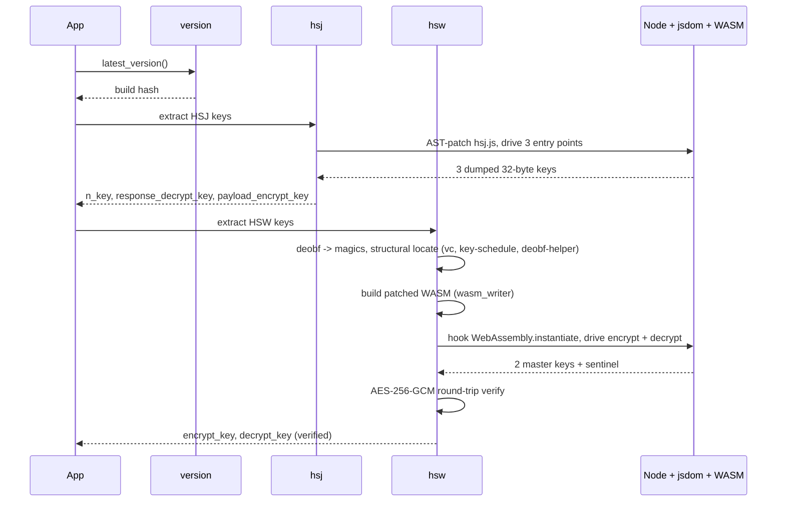

<div align="center">

<h1>HCAPTCHA HSJ HSW Reversed</h1>

<p><strong>Byte-accurate master-key extraction for hCaptcha's <code>hsj.js</code> and <code>hsw.js</code> — all five AES-256-GCM keys per build, in eight seconds.</strong></p>

<p>
  
  
  
</p>

<p>
  <a href="https://github.com/CircuitSavage/hcaptcha-hsj-hsw-reversed/actions/workflows/refresh-keys.yml"></a>
  <a href="https://github.com/CircuitSavage/hcaptcha-hsj-hsw-reversed/actions/workflows/ci.yml"></a>
</p>

<p>
  <a href="https://t.me/jujucodings"></a>
</p>

<p>
  <a href="#quick-start">Quick Start</a> &nbsp;·&nbsp;
  <a href="#how-it-works">How it Works</a> &nbsp;·&nbsp;
  <a href="#sdk">SDK</a> &nbsp;·&nbsp;
  <a href="#repository-structure">Structure</a> &nbsp;·&nbsp;
  <a href="#documentation">Docs</a>
</p>

</div>

---

<div align="center">

### Need a captcha solver?

For **Cloudflare Turnstile**, **Cloudflare 5s challenge**, **AWS WAF**, and **DataDome**:
<br>
<a href="https://peak.fo"></a>
<br>
<sub>API-first solving · <strong>$0.50 – $1.20 / 1K</strong> · volume tiers · sub-second response · <a href="https://peak.fo">peak.fo</a></sub>

</div>

---

## Introduction

hCaptcha ships two compiled bundles to every browser. Both encrypt their wire traffic with static **AES-256-GCM** master keys baked into each build.

<table>
<thead>
<tr><th>Bundle</th><th>Compile target</th><th>Keys</th></tr>
</thead>
<tbody>
<tr>
<td><code>hsj.js</code></td>
<td>asm.js-style compiled JS</td>
<td><code>n_key</code> · <code>response_decrypt_key</code> · <code>payload_encrypt_key</code></td>
</tr>
<tr>
<td><code>hsw.js</code></td>
<td>wasm-bindgen Rust → WebAssembly</td>
<td><code>encrypt_key</code> · <code>decrypt_key</code></td>
</tr>
</tbody>
</table>

This package recovers all **five** keys per build, deterministically — no candidate-guessing, no hardcoded indices. Every build's `hsw.js` randomises its WASM function indices, magic numbers, locals, and stack offsets; the fetcher locates each piece by structural role.

The HSW encrypt key is mathematically verified per fetch via the AES-256-GCM authentication tag — false-positive rate **2⁻¹²⁸**.

<details>
<summary><strong>Sample output</strong> (click to expand)</summary>

```json
{
  "version": "85205c14d08c1288bd2348025639e667aa2ca31bd57ad96251110595ec621384",
  "hsj": {
    "n_key":                "fe1ba43f33813dbac034ef12f34f3ee371b09057e2a25346a652c681edb2104b",
    "response_decrypt_key": "2fb5e0f6aab9596b2001c45ce12cad34e82d579dfea24409fe9b7de4b82d4028",
    "payload_encrypt_key":  "b2837807eecf9221db94d24337f122d093f70c93efb7d7fc1356e57363e27e28"
  },
  "hsw": {
    "encrypt_key":          "7b7f921adc6ccfd22cc316c2040c7fa785b49edb6d1ff6684bfbe21b0359f945",
    "decrypt_key":          "c7e0fadbbca88ee31bdd12f8936b6ecf2958f4a66d71cfc82b1da739964397f8"
  },
  "cipher":      "AES-256-GCM",
  "wire_format": {
    "hsj": "ct(N) || tag(16) || iv(12) || 0x00",
    "hsw": "iv(12) || ct(N) || tag(16)"
  },
  "verified": { "hsw_encrypt_key": true }
}
```

</details>

---

## Quick Start

```bash
git clone https://github.com/CircuitSavage/hcaptcha-hsj-hsw-reversed
cd hcaptcha-hsj-hsw-reversed

pip install pycryptodome xxhash msgpack jsbeautifier requests
npm install

PYTHONPATH=src python -m hcaptcha
```

Or via the SDK:

```python
from hcaptcha import KeyFetcher

keys = KeyFetcher().fetch()
print(keys["hsj"]["n_key"])
print(keys["hsw"]["encrypt_key"])
```

End-to-end runtime: ~8 seconds, including the deobfuscation pass.

### Auto-refresh

A GitHub Actions workflow runs every 12 hours, re-extracts the keys for the current build, and commits the snapshot to [`data/keys.json`](data/keys.json). Historical per-build snapshots accumulate under [`data/archive/`](data/archive/). Manual runs available via the [Actions tab](https://github.com/CircuitSavage/hcaptcha-hsj-hsw-reversed/actions/workflows/refresh-keys.yml).

```bash
# always-current keys without running the fetcher yourself:
curl -L https://raw.githubusercontent.com/CircuitSavage/hcaptcha-hsj-hsw-reversed/main/data/keys.json
```

---

## How it works



| Step | Module | Output |
|------|--------|--------|
| Version discovery | `hcaptcha.version` | Asset URL with build hash |
| HSJ extraction | `hcaptcha.hsj` | 3 AES-256 keys (AST patch on the key schedule) |
| HSW extraction | `hcaptcha.hsw` | 2 AES-256 keys (WASM bytecode patch) |
| Unified entry | `hcaptcha.keyfetcher` | All 5 keys + cipher / wire metadata |

**HSJ — AST patching.** `hsj.js` keeps its AES keys in a JS-managed `Int8Array` heap. The key schedule always allocates a 480-byte stack frame with the 32-byte master key at offset 0. We AST-patch that prologue to copy those 32 bytes into a JS array each time it fires, then drive the three entry points.

**HSW — WASM bytecode patching.** `hsw.js` uses RustCrypto `aes-soft` fixslice32. The master key never lives as 32 contiguous plain bytes in linear memory. We patch the WASM bytecode itself: 8 calls to the build's XOR-deobf helper at the key schedule's entry, each copying one deobfuscated key word to a fixed scratch region. JS reads scratch via a new `__peek32` export added to the same patched binary.

---

## Installation

Requires **Python 3.10+** and **Node 18+**.

```bash
# Python deps
pip install pycryptodome xxhash msgpack jsbeautifier requests

# Node deps (acorn, astring, jsdom, canvas)
npm install
```

Optional — install the Python package itself:

```bash
pip install -e .
hcaptcha           # CLI prints all 5 keys as JSON
```

---

## SDK

The Python package exposes four classes. Import what you need.

| API | Returns | Use case |
|-----|---------|----------|
| `KeyFetcher().fetch()` | All 5 keys + metadata | Most users — single call |
| `HSJKeyFetcher().fetch_keys()` | 3 HSJ keys | HSJ-only workloads |
| `HSWKeyFetcher().fetch()` | 2 HSW keys + verification | HSW-only workloads |
| `HSWBridge()` | Encrypt / decrypt / solve as a service | Black-box wire-compatible traffic |

Each key works as a standard AES-256-GCM key with any library:

```python
from Crypto.Cipher import AES
from hcaptcha import KeyFetcher

keys = KeyFetcher().fetch()
hsw_encrypt = bytes.fromhex(keys["hsw"]["encrypt_key"])

# wire: iv(12) || ct(N) || tag(16)
iv, ct, tag = blob[:12], blob[12:-16], blob[-16:]
pt = AES.new(hsw_encrypt, AES.MODE_GCM, nonce=iv).decrypt_and_verify(ct, tag)
```

---

## Wire formats

```
HSJ:  ct(N) ‖ tag(16) ‖ iv(12) ‖ 0x00      ← trailing version byte
HSW:  iv(12) ‖ ct(N)  ‖ tag(16)             ← no trailer
```

Both bundles use AES-256-GCM with **empty AAD** and a 12-byte random IV per call.

---

## Repository structure

```
hcaptcha-hsj-hsw-reversed/
├── README.md
├── LICENSE
├── pyproject.toml
├── package.json
│
├── docs/                            ← deep-dive documentation
│   ├── 00-architecture.md           overall flow + pipeline
│   ├── 01-hsj-bundle.md             HSJ internals
│   ├── 02-hsw-bundle.md             HSW internals
│   ├── 03-deobfuscation.md          12-pass pipeline
│   ├── 04-key-extraction.md         method per key
│   ├── 05-wasm-internals.md         WASM 1.0 format
│   ├── 06-fixslice32.md             bit-sliced AES math
│   └── 07-wasm-patching.md          bytecode-patching technique
│
├── examples/
│   └── fetch_all.py
│
└── src/hcaptcha/                    Python package
    ├── __init__.py
    ├── __main__.py                  python -m hcaptcha
    ├── keyfetcher.py                unified — all 5 keys
    ├── hsj.py                       HSJ extractor
    ├── hsw.py                       HSW extractor (bytecode patch)
    ├── hsw_bridge.py                HSWBridge + HSWAnalyzer
    ├── algorithm.py                 AES helpers
    ├── log.py                       Logger
    ├── version.py                   build-version discovery
    │
    └── tools/                       internal infrastructure
        ├── wasm_disasm.py           WASM 1.0 disassembler
        ├── wasm_writer.py           WASM 1.0 byte-perfect re-emitter
        ├── fixslice_inverse.py      fixslice32 reference
        ├── deobf.py + deobf.js      12-pass deobfuscator
        └── js_runtime.py            +  _js_runner.js   Node + jsdom sandbox
```

---

## Documentation

| Doc | Contents |
|-----|----------|
| [`docs/00-architecture.md`](docs/00-architecture.md) | Overall flow, repo map, pipeline |
| [`docs/01-hsj-bundle.md`](docs/01-hsj-bundle.md) | HSJ internals, AST-patch extraction |
| [`docs/02-hsw-bundle.md`](docs/02-hsw-bundle.md) | HSW dispatcher, wbg shim, wire formats |
| [`docs/03-deobfuscation.md`](docs/03-deobfuscation.md) | The 12-pass deobf pipeline |
| [`docs/04-key-extraction.md`](docs/04-key-extraction.md) | Per-key methods, what works |
| [`docs/05-wasm-internals.md`](docs/05-wasm-internals.md) | WASM 1.0 binary format reference |
| [`docs/06-fixslice32.md`](docs/06-fixslice32.md) | Bit-sliced AES math |
| [`docs/07-wasm-patching.md`](docs/07-wasm-patching.md) | The bytecode-patching technique |

---

## Disclaimer

For authorized security research and education only. Do not use on systems you are not permitted to test. Not affiliated with, endorsed by, or associated with [hCaptcha](https://www.hcaptcha.com). Takedown requests: contact via Telegram.

---

## Contact

<p>
  <a href="https://t.me/jujucodings"></a>
</p>
