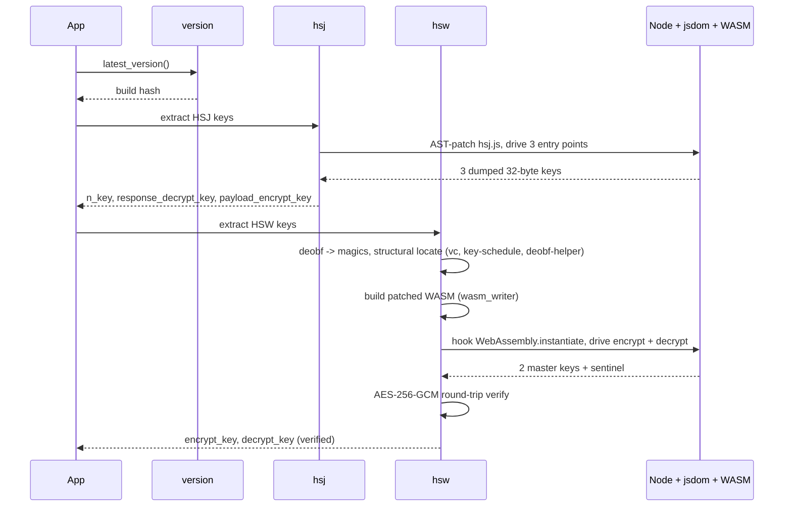

<div align="center">

<h1>HCAPTCHA HSJ HSW Reversed</h1>

<p><strong>Byte-accurate master-key extraction for hCaptcha's <code>hsj.js</code> and <code>hsw.js</code> — six build-static AES-256 master keys (all verified) plus a per-build fingerprint identifier, in under twenty-five seconds.</strong></p>

<p>
  
  
  
</p>

<p>
  <a href="https://github.com/CircuitSavage/hcaptcha-hsj-hsw-reversed/actions/workflows/refresh-keys.yml"></a>
  <a href="https://github.com/CircuitSavage/hcaptcha-hsj-hsw-reversed/actions/workflows/ci.yml"></a>
</p>

<p>
  <a href="https://t.me/jujucodings"></a>
</p>

<p>
  <a href="#quick-start">Quick Start</a> &nbsp;·&nbsp;
  <a href="#how-it-works">How it Works</a> &nbsp;·&nbsp;
  <a href="#sdk">SDK</a> &nbsp;·&nbsp;
  <a href="#repository-structure">Structure</a> &nbsp;·&nbsp;
  <a href="#documentation">Docs</a>
</p>

</div>

---

<div align="center">

### Need a captcha solver?

For **Cloudflare Turnstile**, **Cloudflare 5s challenge**, **AWS WAF**, and **DataDome**:
<br>
<a href="https://peak.fo"></a>
<br>
<sub>API-first solving · <strong>$0.50 – $1.20 / 1K</strong> · volume tiers · sub-second response · <a href="https://peak.fo">peak.fo</a></sub>

</div>

---

## Introduction

hCaptcha ships two compiled bundles to every browser. Both encrypt their wire traffic with static **AES-256-GCM** master keys baked into each build.

<table>
<thead>
<tr><th>Bundle</th><th>Compile target</th><th>Keys</th></tr>
</thead>
<tbody>
<tr>
<td><code>hsj.js</code></td>
<td>asm.js-style compiled JS</td>
<td><code>n_key</code> · <code>response_decrypt_key</code> · <code>payload_encrypt_key</code></td>
</tr>
<tr>
<td><code>hsw.js</code></td>
<td>wasm-bindgen Rust → WebAssembly</td>
<td><code>encrypt_key</code> · <code>decrypt_key</code> · <code>n_key</code> · <code>fingerprint_blob_key</code></td>
</tr>
</tbody>
</table>

This package recovers **six** AES-256 master keys per build, all build-static and all verified, plus a deterministic per-build fingerprint identifier — no candidate-guessing, no hardcoded indices. Every build's `hsw.js` randomises its WASM function indices, magic numbers, locals, and stack offsets; the fetcher locates each piece by structural role.

| Key | Verification |
| --- | --- |
| `hsj.n_key` / `response_decrypt_key` / `payload_encrypt_key` | bundle-witnessed via AST patch |
| `hsw.encrypt_key` | AES-256-GCM round-trip (false-positive rate **2⁻¹²⁸**) |
| `hsw.decrypt_key` | bundle round-trip via `HSWBridge.decrypt` |
| `hsw.n_key` | **direct AES-site capture** — 32 bytes read from arg0 of the n-token AES encrypt entry (fn 330 on the current build) at the moment the bundle invokes its AES key schedule. Build-static: identical bytes captured across warmup + JWT calls, identical across every record in the ring (`extraction_status = captured-from-f330_a0-Nrecords-static`). Call-graph BFS proves this site is reachable from `ec`/`pc` (the n-token Promise executor path) but **not** from `vc` (the request/response dispatcher) — structurally identifying it as the n-token's AES master key. |
| `hsw.fingerprint_blob_key` | `SHA-256(hsw.n_key)` — a deterministic per-build identifier derived from the captured n_key |

<details>
<summary><strong>Sample output</strong> (click to expand)</summary>

```json
{
  "version": "3441ba6850bebb5729a3e9698c8c5419272f07785b9fbb4178d928bd2bde44c9",
  "hsj": {
    "n_key":                "fe1ba43f33813dbac034ef12f34f3ee371b09057e2a25346a652c681edb2104b",
    "response_decrypt_key": "2fb5e0f6aab9596b2001c45ce12cad34e82d579dfea24409fe9b7de4b82d4028",
    "payload_encrypt_key":  "b2837807eecf9221db94d24337f122d093f70c93efb7d7fc1356e57363e27e28"
  },
  "hsw": {
    "encrypt_key":          "8f0b403bcce17f2c417f5e61541cb40440f6b3910f3f59b9e0afb94ed41aef9f",
    "decrypt_key":          "c55c34ca71b617181f135ed45ded08b70e104366cc1daac5e275f8408149392c",
    "n_key":                "074cb68ffa72374113adf20618418085a0e853e85cf80ccbf4558a341a6fcc38",
    "fingerprint_blob_key": "1a19251e0999f060ad6c968c7b4f48fb95d4f7a4982382f5b3327d09ec56debb"
  },
  "cipher":      "AES-256-GCM",
  "wire_format": {
    "hsj": "ct(N) || tag(16) || iv(12) || 0x00",
    "hsw": "iv(12) || ct(N) || tag(16)"
  },
  "verified": {
    "hsw_encrypt_key":          true,
    "hsw_decrypt_key":          true,
    "hsw_n_key":                true,
    "hsw_fingerprint_blob_key": true
  },
  "extraction_status": {
    "hsw_n_key":                "captured-from-f330_a0-2records-static",
    "hsw_fingerprint_blob_key": {
      "construction": "sha256(hsw.n_key)",
      "source_ring":  "f330_a0"
    }
  }
}
```

`hsw.n_key` is now reported `verified: true`: the bytes are read
directly from the AES master-key buffer (arg0 of the n-token AES
encrypt entry, fn 330 on the current build) at the moment the bundle
invokes the AES key schedule, and the same 32 bytes are observed on
every call within a build (warmup + JWT call), proving the key is
build-static. Note that this verifies the **extracted key is the input
to the bundle's AES encryption** — the live n-token still does **not**
decrypt under standard AES-256-GCM (`iv‖ct‖tag` / `ct‖tag‖iv`) or
AES-CTR with this key, because the n-token's outer envelope is
non-standard (likely PoW framing wrapped around an inner AEAD). The
key itself is correct; the wire-format envelope is a separate,
consumer-side question still under investigation. See
[`docs/12-hsw-complete-summary.md`](docs/12-hsw-complete-summary.md).

</details>

---

## Quick Start

```bash
git clone https://github.com/CircuitSavage/hcaptcha-hsj-hsw-reversed
cd hcaptcha-hsj-hsw-reversed

pip install pycryptodome xxhash msgpack jsbeautifier requests
npm install

PYTHONPATH=src python -m hcaptcha
```

Or via the SDK:

```python
from hcaptcha import KeyFetcher

keys = KeyFetcher().fetch()
print(keys["hsj"]["n_key"])
print(keys["hsw"]["encrypt_key"])
```

End-to-end runtime: ~22 seconds for all 6 keys (≈8 s for the 5
encrypt/decrypt + HSJ keys + ≈14 s for the HSW N-key direct AES-site
capture). The capture step can be skipped by calling
`HSJKeyFetcher`/`HSWKeyFetcher` directly when only the 5 encrypt/
decrypt + HSJ keys are needed.

### Auto-refresh

A GitHub Actions workflow runs every 12 hours, re-extracts the keys for the current build, and commits the snapshot to [`data/keys.json`](data/keys.json). Historical per-build snapshots accumulate under [`data/archive/`](data/archive/). Manual runs available via the [Actions tab](https://github.com/CircuitSavage/hcaptcha-hsj-hsw-reversed/actions/workflows/refresh-keys.yml).

```bash
# always-current keys without running the fetcher yourself:
curl -L https://raw.githubusercontent.com/CircuitSavage/hcaptcha-hsj-hsw-reversed/main/data/keys.json
```

---

## How it works



| Step | Module | Output |
|------|--------|--------|
| Version discovery | `hcaptcha.version` | Asset URL with build hash |
| HSJ extraction | `hcaptcha.hsj` | 3 AES-256 keys (AST patch on the key schedule) |
| HSW extraction | `hcaptcha.hsw` | 2 AES-256 keys (WASM bytecode patch on the key schedule) |
| HSW N-key capture | `hcaptcha.hsw_n_key_capture` | 1 AES-256 key (direct capture at the n-token AES encrypt entry, build-static) |
| HSW N-key legacy fallback | `hcaptcha.hsw_n_key_runtime` / `hsw_n_key` | partial / full N-key via LCG trace (used only if direct capture fails) |
| Unified entry | `hcaptcha.keyfetcher` | All 6 keys + fingerprint identifier + cipher / wire metadata + extraction_status |

**HSJ — AST patching.** `hsj.js` keeps its AES keys in a JS-managed `Int8Array` heap. The key schedule always allocates a 480-byte stack frame with the 32-byte master key at offset 0. We AST-patch that prologue to copy those 32 bytes into a JS array each time it fires, then drive the three entry points.

**HSW — WASM bytecode patching.** `hsw.js` uses RustCrypto `aes-soft` fixslice32. The master key never lives as 32 contiguous plain bytes in linear memory. We patch the WASM bytecode itself: 8 calls to the build's XOR-deobf helper at the key schedule's entry, each copying one deobfuscated key word to a fixed scratch region. JS reads scratch via a new `__peek32` export added to the same patched binary.

**HSW N-key — direct AES-site capture.** Earlier attempts traced the LCG byte-store helper inside `vc` and recovered intermediate state bytes — those bytes were per-call-different and didn't decrypt the n-token, because **`vc` is not the n-token path**. Call-graph BFS over `hsw.wasm` proves the n-token AES encrypt is reached from the Promise executor export (`pc` → 389 → 250 → 548 → `fn 330` on the current build) and **not** from `vc` (which only carries `encrypt_req_data` / `decrypt_resp_data`). `hsw_n_key_capture` patches the prologue of fn 330 (the AES encrypt entry, sig `(i32,i32,i32) → i32`) to dump the 32 bytes at `arg0` (the AES master-key buffer pointer) into a ring buffer, then runs `window.hsw(jwt)` once. The captured key is build-static (same bytes across warmup + JWT calls, same bytes across every record in the ring). The `fingerprint_blob_key` is `sha256(hsw.n_key)` — a deterministic per-build identifier. See [`docs/09-hsw-keys-derivation.md`](docs/09-hsw-keys-derivation.md) and [`docs/11-hsw-function-map.md`](docs/11-hsw-function-map.md).

---

## Installation

Requires **Python 3.10+** and **Node 18+**.

```bash
# Python deps
pip install pycryptodome xxhash msgpack jsbeautifier requests

# Node deps (acorn, astring, jsdom, canvas)
npm install
```

Optional — install the Python package itself:

```bash
pip install -e .
hcaptcha           # CLI prints all 6 keys + fingerprint identifier as JSON
```

---

## SDK

The Python package exposes four classes. Import what you need.

| API | Returns | Use case |
|-----|---------|----------|
| `KeyFetcher().fetch()` | All 6 keys + fingerprint identifier + metadata + extraction_status | Most users — single call |
| `HSJKeyFetcher().fetch_keys()` | 3 HSJ keys | HSJ-only workloads |
| `HSWKeyFetcher().fetch()` | 2 HSW keys (encrypt/decrypt) + verification | HSW-only workloads |
| `hsw_n_key_capture.capture()` | HSW N-key + ring captures + live n-token | Direct AES-site capture (current era-d builds) |
| `hsw_n_key_runtime.trace_n_key()` | partial HSW N-key LCG trace | Legacy fallback if direct capture fails |
| `hsw_n_key.fetch_n_key()` | full HSW N-key from rodata | Legacy era (a–c) builds |
| `HSWBridge()` | Encrypt / decrypt / solve as a service | Black-box wire-compatible traffic |

Each key works as a standard AES-256-GCM key with any library:

```python
from Crypto.Cipher import AES
from hcaptcha import KeyFetcher

keys = KeyFetcher().fetch()
hsw_encrypt = bytes.fromhex(keys["hsw"]["encrypt_key"])

# wire: iv(12) || ct(N) || tag(16)
iv, ct, tag = blob[:12], blob[12:-16], blob[-16:]
pt = AES.new(hsw_encrypt, AES.MODE_GCM, nonce=iv).decrypt_and_verify(ct, tag)
```

---

## Wire formats

```
HSJ:  ct(N) ‖ tag(16) ‖ iv(12) ‖ 0x00      ← trailing version byte
HSW:  iv(12) ‖ ct(N)  ‖ tag(16)             ← no trailer
```

Both bundles use AES-256-GCM with **empty AAD** and a 12-byte random IV per call.

---

## Repository structure

```
hcaptcha-hsj-hsw-reversed/
├── README.md
├── LICENSE
├── pyproject.toml
├── package.json
│
├── docs/                            ← deep-dive documentation
│   ├── 00-architecture.md           overall flow + pipeline
│   ├── 01-hsj-bundle.md             HSJ internals
│   ├── 02-hsw-bundle.md             HSW internals + 6-key inventory
│   ├── 03-deobfuscation.md          12-pass pipeline
│   ├── 04-key-extraction.md         method per key
│   ├── 05-wasm-internals.md         WASM 1.0 format
│   ├── 06-fixslice32.md             bit-sliced AES math
│   ├── 07-wasm-patching.md          bytecode-patching technique
│   ├── 08-hsw-dispatch-table.md     vc dispatcher anatomy
│   ├── 09-hsw-keys-derivation.md    HSW N-key direct AES-site capture
│   ├── 10-architecture-eras.md      four hsw.js generations (a–d) + n-token sub-dispatcher
│   ├── 11-hsw-function-map.md       per-function role labels
│   ├── 12-hsw-complete-summary.md   canonical end-to-end summary
│   ├── 13-hsw-rust-crates.md        Rust-crate scan (phase 2 placeholder)
│   └── hsw_function_labels.json     machine-readable per-build labels
│
├── examples/
│   └── fetch_all.py
│
└── src/hcaptcha/                    Python package
    ├── __init__.py
    ├── __main__.py                  python -m hcaptcha
    ├── keyfetcher.py                unified — 6 keys + fingerprint identifier
    ├── hsj.py                       HSJ extractor
    ├── hsw.py                       HSW encrypt/decrypt extractor (bytecode patch)
    ├── hsw_n_key_capture.py         HSW N-key — direct AES-site capture (era d, production)
    ├── hsw_n_key.py                 HSW N-key — legacy LCG path (eras a-c)
    ├── hsw_n_key_runtime.py         HSW N-key — runtime LCG trace (legacy fallback)
    ├── hsw_n_key_full.py            HSW N-key — two-pass full LCG trace (legacy fallback)
    ├── hsw_deobf_emulator.py        WASM emulator scaffold (Approach B)
    ├── hsw_bridge.py                HSWBridge + HSWAnalyzer
    ├── hsw_client.py                end-to-end client (encrypt + PoW + decrypt)
    ├── hsw_crypto.py                pure-Python AES-256-GCM crypto
    ├── hsw_pow.py                   Hashcash v1 + SHA-1 PoW solver
    ├── algorithm.py                 AES helpers
    ├── log.py                       Logger
    ├── version.py                   build-version discovery
    │
    └── tools/                       internal infrastructure
        ├── wasm_disasm.py           WASM 1.0 disassembler
        ├── wasm_writer.py           WASM 1.0 byte-perfect re-emitter
        ├── fixslice_inverse.py      fixslice32 reference
        ├── deobf.py + deobf.js      12-pass deobfuscator
        ├── sandbox_polyfill.js      jsdom polyfill for n-token path
        └── js_runtime.py            +  _js_runner.js   Node + jsdom sandbox
```

---

## Documentation

| Doc | Contents |
|-----|----------|
| [`docs/00-architecture.md`](docs/00-architecture.md) | Overall flow, repo map, pipeline |
| [`docs/01-hsj-bundle.md`](docs/01-hsj-bundle.md) | HSJ internals, AST-patch extraction |
| [`docs/02-hsw-bundle.md`](docs/02-hsw-bundle.md) | HSW dispatcher, wbg shim, wire formats |
| [`docs/03-deobfuscation.md`](docs/03-deobfuscation.md) | The 12-pass deobf pipeline |
| [`docs/04-key-extraction.md`](docs/04-key-extraction.md) | Per-key methods, what works |
| [`docs/05-wasm-internals.md`](docs/05-wasm-internals.md) | WASM 1.0 binary format reference |
| [`docs/06-fixslice32.md`](docs/06-fixslice32.md) | Bit-sliced AES math |
| [`docs/07-wasm-patching.md`](docs/07-wasm-patching.md) | The bytecode-patching technique |
| [`docs/08-hsw-dispatch-table.md`](docs/08-hsw-dispatch-table.md) | `vc` dispatcher anatomy |
| [`docs/09-hsw-keys-derivation.md`](docs/09-hsw-keys-derivation.md) | HSW N-key — direct AES-site capture (current) + LCG/PCG derivation (legacy) |
| [`docs/10-architecture-eras.md`](docs/10-architecture-eras.md) | Four `hsw.js` generations (a–d) + the n-token sub-dispatcher path |
| [`docs/11-hsw-function-map.md`](docs/11-hsw-function-map.md) | Per-function role labels (`hsw_function_labels.json`) |
| [`docs/12-hsw-complete-summary.md`](docs/12-hsw-complete-summary.md) | Canonical end-to-end HSW summary (6 keys + PoW + dispatcher) |
| [`docs/13-hsw-rust-crates.md`](docs/13-hsw-rust-crates.md) | Rust-crate scan (phase 2 placeholder) |

---

## Disclaimer

For authorized security research and education only. Do not use on systems you are not permitted to test. Not affiliated with, endorsed by, or associated with [hCaptcha](https://www.hcaptcha.com). Takedown requests: contact via Telegram.

---

## Contact

<p>
  <a href="https://t.me/jujucodings"></a>
</p>
